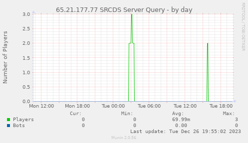

# munin srcds

Munin plugin written in Python to query Valve SRCDS servers via anonymous a2s info queries (like in Steam server browser).

Screenshot:



## Installation

Copy the plugin file [`srcds`](srcds) to your munin plugins folder at `/usr/share/munin/plugins/srcds`, then create a symbolic link into your Munin config at `/etc/munin/plugins/srcds`.

Install the the [a2s plugin](https://pypi.org/project/python-a2s/), this is required to run the plugin: `pip3 install python-a2s`

Add a configuration block to your Munin config, for example:

```
[srcds]
user steam
env.ip 127.0.0.1
env.port 27015
```

## License

MIT

